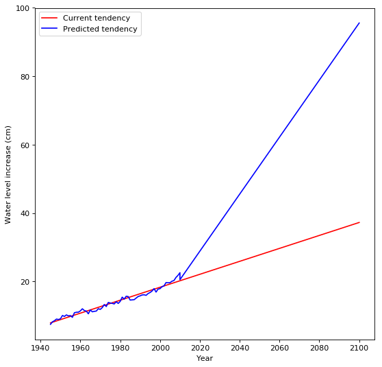

# NASA Space Apps Challenge Hackathon @ Trieste

## **MelTS project: Predicting Sea Level Rise and Its Consequences**

We are a team of six students at the first year of the Data Science and Scientific Computing program offered by University of Trieste in collaboration with SISSA.

We decided to exploit NASA datasets in order to perform a very basic analysis of the global causes of a sea level increase.
Moreover, we applied our findings to Trieste's local context, bringing a reflexion about socioeconomical consequences of this trend.

## **Development Steps**

### **1. Collecting Meaningful Data**

In order to make a prediction about the sea level rise worldwide, we looked for different factors which are known causes for this trend and collected chronological data on a large time span to make the prediction more reliable.

The three factors used to predict sea level rise are the following:

1. **_Global Temperature Trends_**

    Data are included from the GISS Surface Temperature (GISTEMP) analysis and the global component of Climate at a Glance (GCAG). They measure annual mean temperature anomalies in degrees Celsius from 1880 to the present.

2. **_Ice Caps Melting Trends_**

    Average cumulative mass balance of “reference” Glaciers worldwide from 1945-2014 sourced from US EPA and the World Glacier Monitoring Service (WGMS). This is cumulative change in mass balance of a set of “reference” glaciers worldwide beginning in 1945.

3. **_CO2 Production Trends_**

    Global CO2 Emissions from fossil-fuels annually since 1751 till 2014.

### **2. Exploiting Data for Predictions**

We performed a multi-classifier regression using the Numpy library on the three datasets and we created a model able to perform predictions on the sea level rise for future years. 

Our prediction is that by 2100 the sea level is gonna increase by 75 centimetres, reaching a total increase of 1 meter since 1945.

It is interesting to note that the other factors we took in account when performing our linear regression make our prediction make the prediction diverge by the current progression of sea level raise. 

The impact of temperature increase, ice melting and CO2 production seems to play a major role in the increasing rate of sea level rise.

### **3. Comparing our Prediction with Real-World Scientific Models**

We compared our predictions with those which were formulated by scientific experts in the environmental and climatological research fields. 

This is especially relevant since our main purpose was to show how some alarming trends could be spotted even by common people with basic knowledge in the field and some data processing skills.

Researcher's forecasts varies widely, going from 20 to around 80 cm for 2100.

In this sense, our forecast is aligned with official predictions. The NASA Empirical Projection in which gas emissions decline after a peak, the [**RCP 2.6**](https://sealevel.nasa.gov/understanding-sea-level/projections/empirical-projections), seems to be the most consistent with our findings, forecasting an increase in sea level of approximately 0.75 meters by the end of the century.

### **4. Applying our Model to the Local Context**

Since Trieste is a coastal city, we decided to consider the consequences of our predicted sea level rise on the city of Trieste.

After an evaluation of socioeconomical activities in the areas touched by the sea level increase, we denoted x critical aspects which will be heavily damaged:

* **_Economical activities_**, especially those in relation with the Port of Trieste, which is notably the first in Italy for the volume of its foreign trades.

* **_Artistic and cultural patrimony_**, since all the historical part of the city will be submerged, including Piazza dell'Unità d'Italia and the Città Vecchia.

* **_Demographical displacement_**, since many residential areas could be affected by the increase of water level, renting cost would probably increase and social activities will change .

## **Resources**

### Global and Forecasting-related

* [**Global Temperatures Time Series Dataset**](https://datahub.io/core/global-temp#readme)

* [**Global Average Absolute Sea Level Change Dataset**](https://datahub.io/core/sea-level-rise)

* [**Average cumulative mass balance of reference Glaciers worldwide Dataset**](https://datahub.io/core/glacier-mass-balance)

* [**Global CO2 Emissions from Fossil Fuels Dataset**](https://datahub.io/core/co2-fossil-global)

* [**NASA Enhanced Shuttle Land Elevation Dataset**](https://www2.jpl.nasa.gov/srtm/)

* [**NASA Empirical Projections of Sea Level Increase**](https://sealevel.nasa.gov/understanding-sea-level/projections/empirical-projections)

* [**PNAS Climate-change-driven acceleration in sea levvel rise**](http://www.pnas.org/content/early/2018/02/06/1717312115)

### Local data and informations

* Rapporto statistico annuale 2017, regione autonoma Friuli Venezia Giulia

* [**Sea Level in Trieste since 1875**](http://www.ts.ismar.cnr.it/node/36)

* [**Portual Authority of Trieste Statistics**](http://www.porto.trieste.it/wp-content/uploads/2017/04/Sintesi_Statistiche_-ESPO_Gennaio-Dicembre_2017.pdf)

## **Challenges in Development Process**

The main challenges we faced during the creation of our project are undoubtedly the creation of a valid model which could take in account many different factors and the search for specific databases that fitted our needs.

